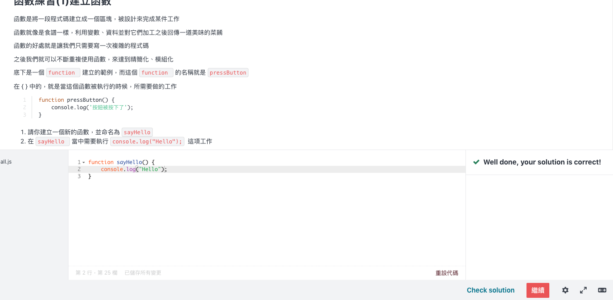
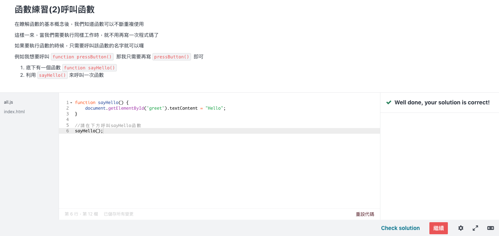
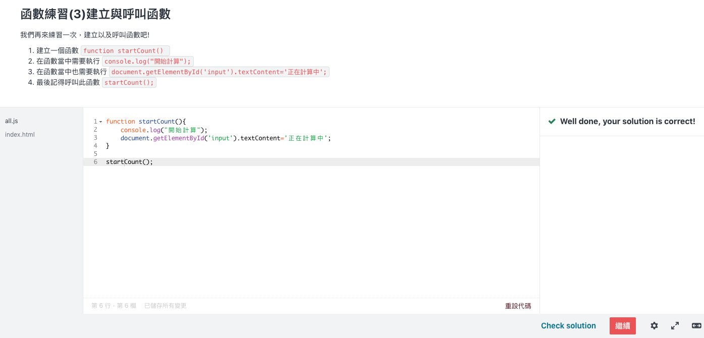
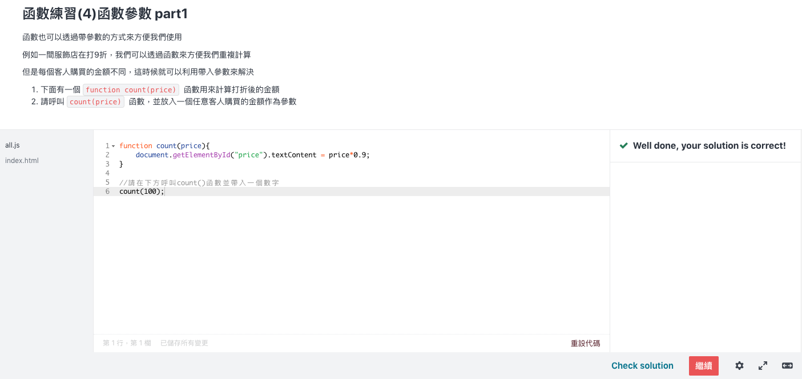
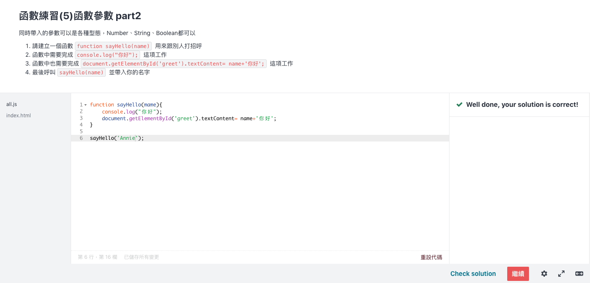
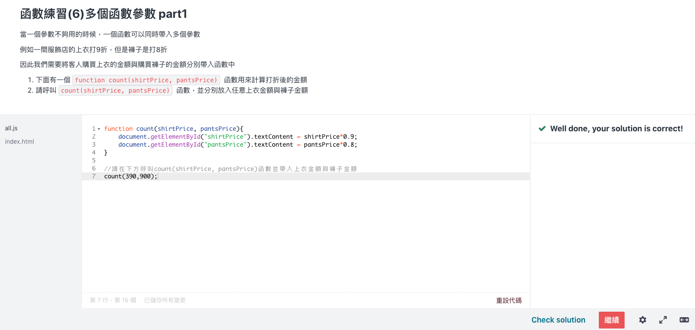

[JavaScript 入門篇 - 學徒的試煉](https://www.udemy.com/course/javascript-learning/)

本課程將會講解如何從無到有學習 JavaScript，除了基礎教學外，我們也提供許多實務上與其他部門合作時的心法通通傳授給你， 不論你是網頁設計師、前端工程師都相當適合從中了解真正實務上設計 JavaScript 時所需要注意的細節！ 

[練習連結](https://zhezheannie.github.io/javascript_practice/index.html)

### 函數練習(1)建立函數

### 函數練習(2)呼叫函數

### 函數練習(3)建立與呼叫函數

### 函數練習(4)Part1

### 函數練習(5)Part2

### 函數練習(6)多個函數參數Part1

