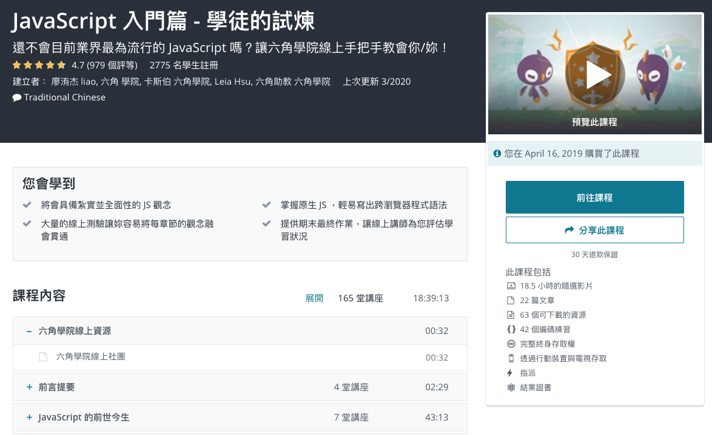

[JavaScript 入門篇 - 學徒的試煉](https://www.udemy.com/course/javascript-learning/)

>本課程將會講解如何從無到有學習 JavaScript，除了基礎教學外，我們也提供許多實務上與其他部門合作時的心法通通傳授給你， 不論你是網頁設計師、前端工程師都相當適合從中了解真正實務上設計 JavaScript 時所需要注意的細節！ 

## [第一週練習](https://zhezheannie.github.io/javascript_practice/week1.html)  javascript基礎、變數、函式

## [第二週練習](https://zhezheannie.github.io/javascript_practice/week2.html) 函式考題

## [第三週練習](https://zhezheannie.github.io/javascript_practice/week3.html)